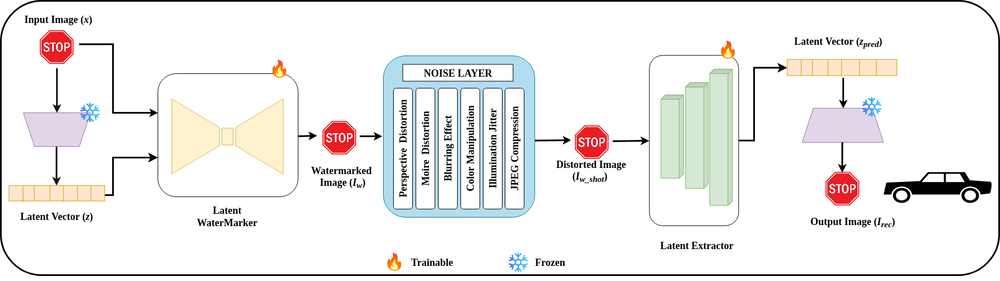

# Latent Watermark for Traffic Sign Recognition (TSR)

## Project Overview
This project implements a **latent-space watermarking framework** for traffic sign recognition (TSR) systems. Unlike traditional watermarking, our method embeds the **latent representation** of a traffic sign directly into the image, ensuring the watermark is **imperceptible**, **robust to digital and physical distortions**, and **preserves classification performance**.

---

## Key features:
- **Latent-space embedding:** Protects images without altering pixel-level information.  
- **Physical-world robustness:** Handles noise, blur, color jitter, and perspective changes.  
- **End-to-end recovery:** Recovers the latent vector and reconstructs the image, ensuring watermark reliability.  
- **Plug-and-play:** Compatible with any TSR model without retraining.

---

## Architecture
 

*Figure:Latent watermarking pipeline for traffic sign images.* The autoencoder extracts the latent representations of the traffic sign images. The U-Net watermarking module embeds these latent representations into the traffic sign images imperceptibly. A noise layer simulation ensures robustness against both digital and physical level perturbations. Finally, the latent extractor recovers the embedded latent representations from the distorted traffic sign images, which are reconstructed by the autoencoder back to the traffic sign image, which is used by the TSR system for accurate recognition.

---

## Dataset
We use the **GTSRB (German Traffic Sign Recognition Benchmark)** dataset.  
It is publicly available and contains over 50,000 labeled images across 43 sign classes.(https://www.kaggle.com/datasets/meowmeowmeowmeowmeow/gtsrb-german-traffic-sign)

---

##  How to Run
1. Clone the repository  
   ```bash
   git clone https://github.com/DEEPESHKUMARDWIVEDI/LatentWatermark-TSR.git
   cd LatentWatermark-TSR

2. Create a Conda environment from the YAML file

   conda env create -f environment.yml

3. Activate the environment

   conda activate latenttsr_tsr

4. Set the Jupyter kernel to use this environment

   python -m ipykernel install --user --name=latenttsr_tsr

5. Open the notebook

   jupyter notebook LatentWatermark_TSR.ipynb


---

data/
├── meta/
├── train/ 
├── test/
├── Meta.csv
├── Train.csv
└── Test.csv

data/
├── train/
│ ├── class_0/
│ ├── class_1/
│ └── ...
├── test/
│ ├── class_0/
│ ├── class_1/
│ └── ...
├── meta.csv
├── train.csv
└── test.csv